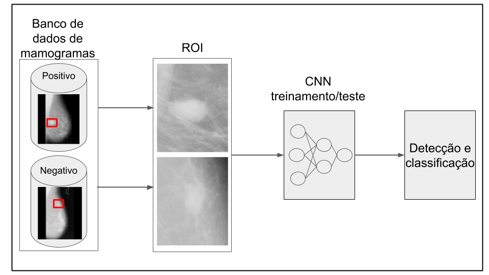

# PIBIC

### Sistema de apoio ao diagnóstico de câncer de mama baseado em redes neurais convolucionais profundas.

 
 
 

## Descrição dos arquivos contidos nesse repositório:

* cnn_kfold_6.ipynb (cnn com os dados M [maligno] e B [benigno] | colab)

* cnn_kfold_6.1ipynb (cnn com os dados M [maligno] e B [benigno e normal] | colab)

* referencias (Referências ultilizadas)

